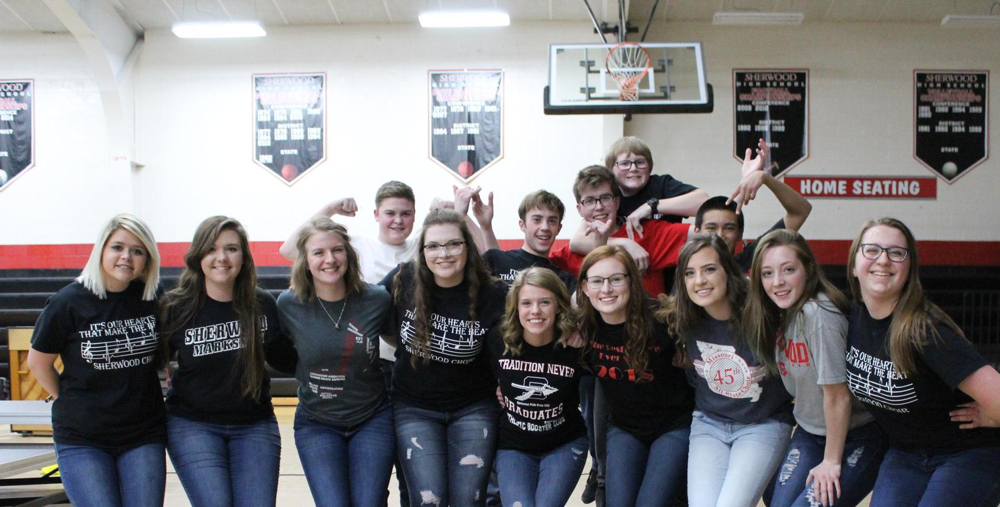

# About Me :upside_down_face:	
[Who am I?](Aboutme.md)  
  

## Background
If you are wanting to more about my background make sure you check out my [background](Background.md). 
## Fun Facts About Me
There are quite a few things that a person doesn't know about me when first seeing me. Some interesting facts about me are that I have been in show choir for four years and ended up being my show choir's president my Senior year as well as their dance captain.  
  

## My family

  
Pictured above is my family. I am the youngest sibling as I have an older brother. My family has been through some tough issues in the past year that we are still recovering from but the key word there is _recovering_. My mom was born deaf and in the last few years her hearing has gotten worse to the point where last year the doctors deemed it necessary for her to have a cochlear implant. During the midst of all of this my older brother was diagnosed with [cancer](https://www.cancer.gov/about-cancer/understanding/what-is-cancer). After starting chemo during my senior year he ended up being allergic to the chemo he was needing and went into cardiac arrest from it. After going into cardiac arrest he ended up passing out in the bathroom where the doctor's found him barely alive. They were able to get him the help he needed and afterwards switched his chemo regiment which led to us staying in the hospital for 6 consecutive days on end while a different chemo was constantly being given to him over those 6 days every two weeks. My senior year I woke up, went to school, worked, went to his house, cleaned his house so he wouldn't get sick, and then made sure he took the medication he needed to take to not become extremely sick. After doing this I would work on homework until about 3 in the morning if not later and start again. While this was going on my mom was undergoing her cochlear procedure. My dad took care of my mom while I took care of my brother most days and nights. Since then my mom has started adjusting to her new type of hearing and my brother is now cancer free.
## Things I participated in during High School
[List View](extracorriculars.md)
